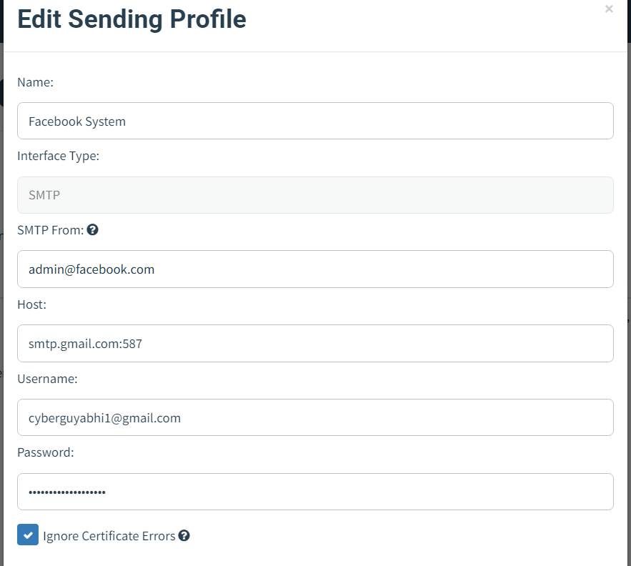
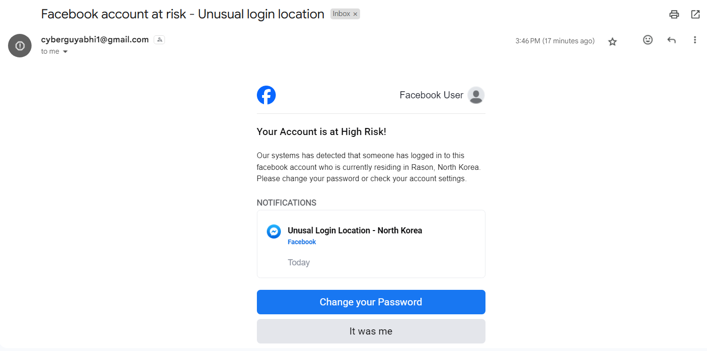
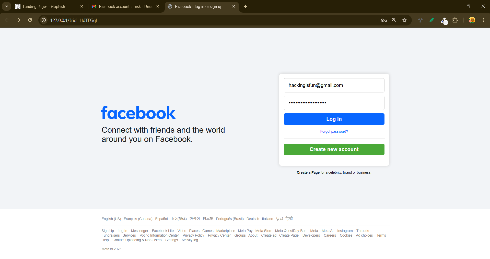
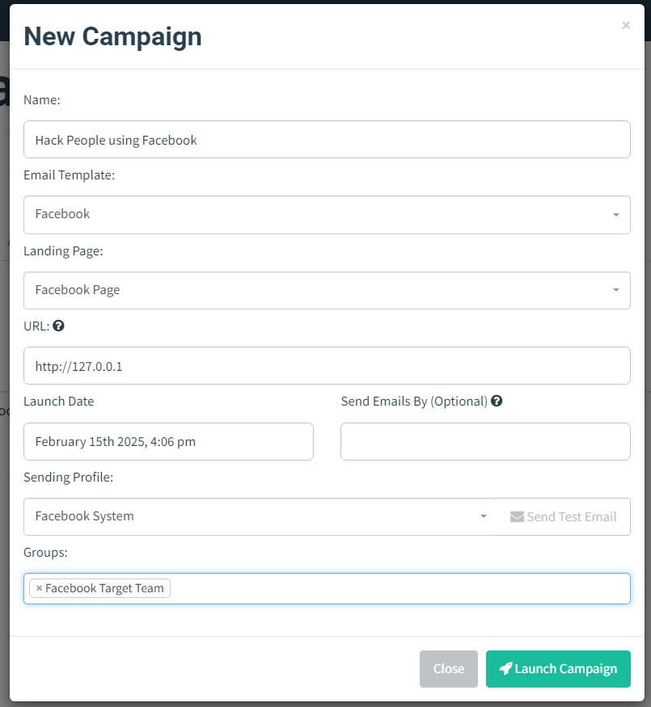
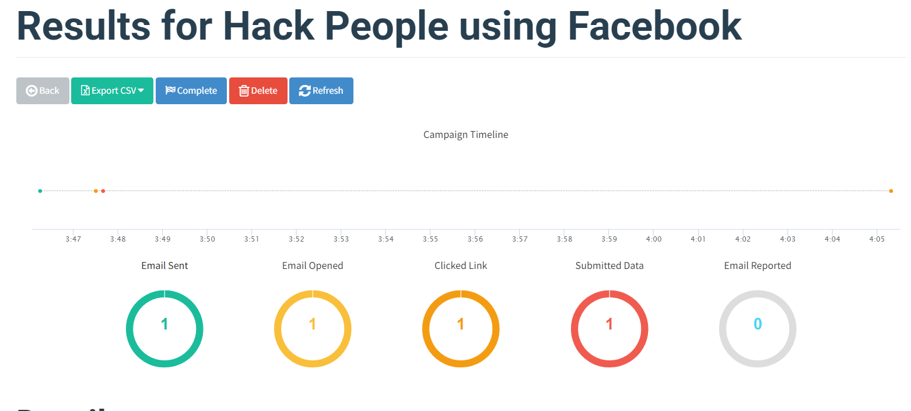
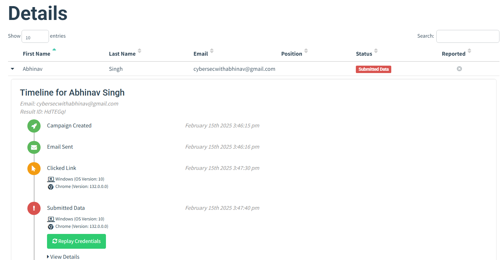
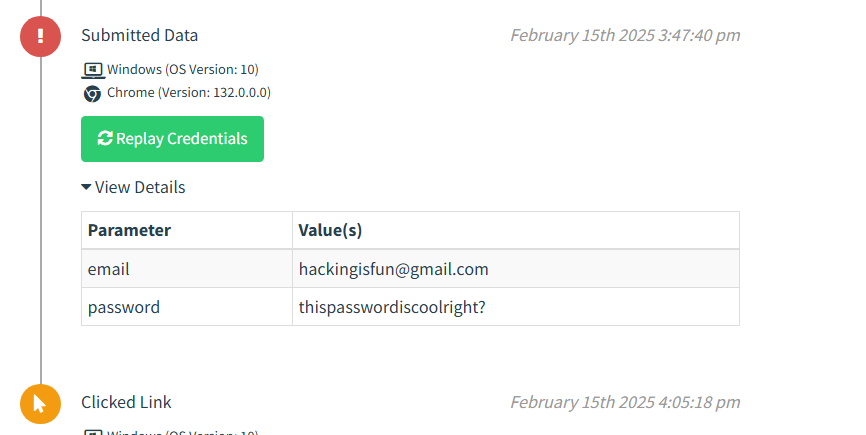

# GoPhish-Simulation
I created a phising simulation using GoPhish and using Facebook landing page as well as Facebook email template. The email template as well as the source code for the Facebook landing page is provided in the other files. 

## SMTP Server Setup
Simple Mail Transfer Protocol is used by GoPhish, in order to send the Emails to the victims of this phishing attams. I have Gmail and one of my testing account `cyberguyabhi1@gmail.com`. The victim account that I used is `cybersecwithabhinav@gmail.com`, which I use on daily basis. Below is the screenshot of SMTP settings page:

Note: I used admin@facebook.com to bypass SPF-checks.

## Email Template [Code Provided]
I used the exact same Email template (not created by me), used by Facebook, so, the email looks legitimate and more people can be victims of this Phishing attack. Apart from that, I carefully choosed the words so, it would be easier of people becoming prey of this attack. Below is the screenshot of email that user will receive.

## Landing Page [Code Provided]
After choosing the perfect template for my email, using HTML and CSS, I designed an exact same Facebook landing page using HTML and CSS, in order to win the trust of people visiting this page. Below is the screenshot of the landing page.

## Final Step - New Campaign
Then, using these template and creating a user group, I created new campaign, that will send the email to each user added to that particular user group. Since this is just a project, I added only one user, which is my own Gmail account.

## Results
Below are the results:

## Final Words
After this project, I feel confident with my Phishing knowledge, and I have added a new tool to my Skill Set. Moreover, I gained confidence in HTML and CSS that if I have the design, I can create an almost same webpage, and by using best HTML and CSS practices.